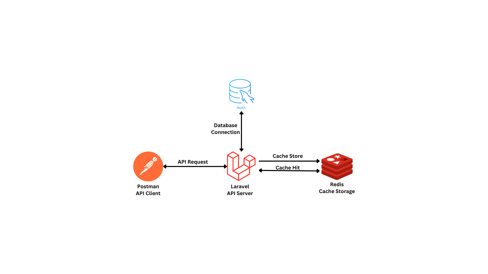
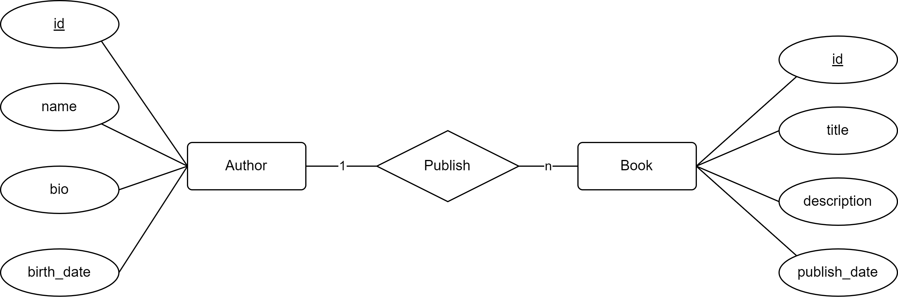

# Project Title

## Overview

### About the Application
Backend API service to provide Author and Book data in Library system. This service was built using Laravel 11, MySQL database, and Redis for caching strategy.

### Key Features
- Author data management
- Book data management

---

## How to Run Locally
1. Clone the repository
2. Run `composer install`
3. Copy the `.env.example` to `.env`, and adjust the database and redis configs accordingly.
4. Run the following command to setup APP_KEY: `php artisan key:generate`
5. Run migrations: `php artisan migrate`
6. Run the unit test: `php artisan test`
7. Start the server: `php artisan serve`

---

## Architecture

### Application Architecture
The application is mainly using MVC architecture from Laravel with default Views component & contents. Because it is mainly focussed to provide API.

#### Components:
- **Framework**: Laravel 11
- **Database**: MySQL
- **Caching**: Redis

### Diagram

---

## ERD (Entity Relationship Diagram)

### Database Design
There are only 2 entities in the database including Author and Book. These entities are tied with one-to-many relationship from Author to Book.

### ERD Diagram

---

## API Documentations

Click [here](docs/api.md) to view the API documentations.

---

## Performance Tuning Technique
This API is using Redis as caching database with predis driver the following caching scenarios:
- Perform cache hit/store in each read operation.
- Clear cache on create, update, and delete operation.
By performing this caching strategy, the API could serve robust data management service for library with millions of books and authors data.